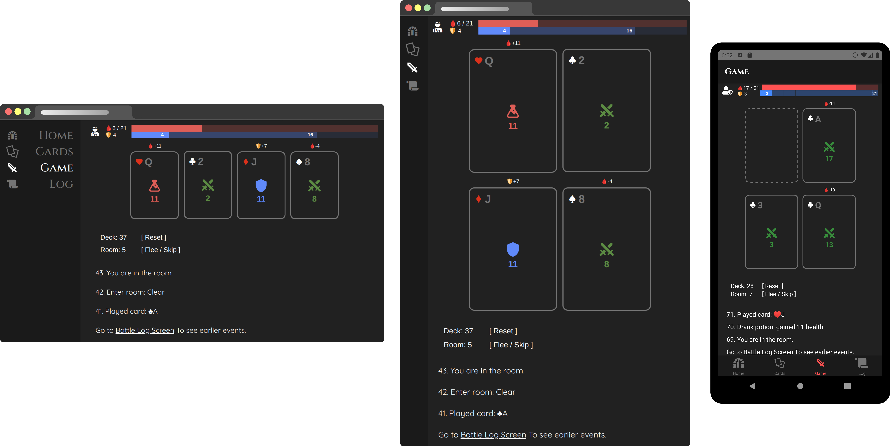
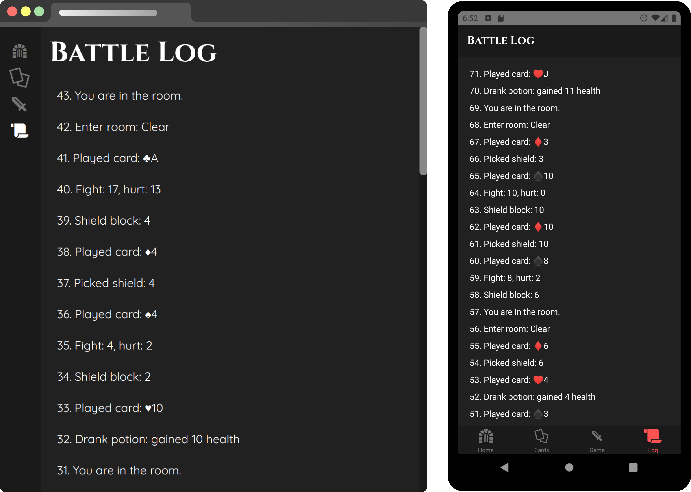

# card-quest

Demo project for my [react-native & react-native-web code sharing article](https://eralp.dev/react-native-mobile-and-web-code-sharing/#Platform%20Specific%20Code)

Play it at https://card-quest.netlify.app !

## Prerequisites
- `yarn install`
- `npx @react-native-community/cli doctor`

## Running web app
- `yarn web-start`

## Running react-native app
- `yarn ios` or `yarn android`

