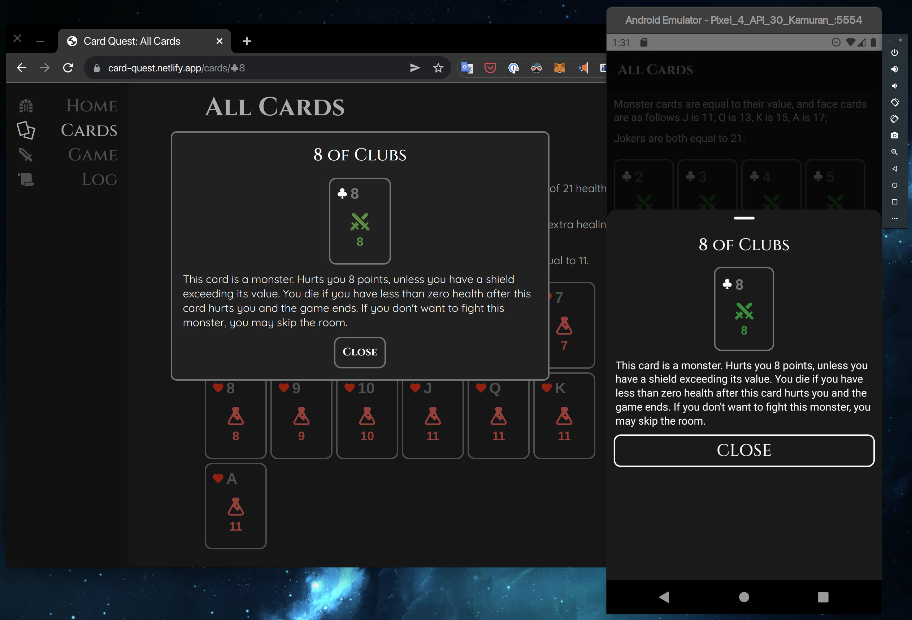

# React Native Web Article series

# Part 1: Cross platform mobile & web code sharing setup.

I have been working on [a demo project called Card Quest][card-quest-source] to explore and learn about sharing code between react-native mobile apps and react web sites.

The project consists of a website and a mobile app with a simple card game. Having a game in it demonstrates some "business logic" code that can be reused across platforms. Since I could not come up with a better idea, I decided to implement [a card game called Donsol](https://boardgamegeek.com/boardgame/197004/donsol). 

What the product does and what kind of game it has in it are not essential as the main focus of this experiment is its implementation. So I won't go into much detail about the game and its rules. However, the special thing about Donsol was that it is a single-player solitaire style turn-based card game, so there was no need to implement multi-player logic since that would be out of the scope of the experiment. You can go to [the project's site][card-quest-site] to learn more about the game and try it. The source code is available at [github.com/eralpkaraduman/card-quest][card-quest-source].

Experiment is mainly about re-using ideally all of the code for the game and most of the UI code in the rest of the app on web and mobile platforms.

There is a technology called [react-native-web](https://necolas.github.io/react-native-web/), which is a great tool for the job, quoting from their website;

> "A compatibility layer between React DOM and React Native. It can be used in new and existing apps, web-only and multi-platform apps.
> React Native for Web uses React DOM to accurately render React Native compatible JavaScript code in a web browser."

React-native-web is a good choice for moving already existing react-native mobile app code to run on web projects. Also it is good for starting a project with it with the goal of code-sharing in mind, which is what I did.

There are several ways to share react-native code to web, some of which would be;

## Option 1: Use Expo
It has a web target already. [Expo](https://docs.expo.dev/workflow/web/) is a framework and a platform for universal React applications. It is a set of tools and services built around React Native and native platforms. If you want to get started quick, wouldn't need fine control, and ok with web app behaving like a mobile app, this is the way to go.
  
## Option 2: Monorepo with shared components module
This is the most popular approach, you put web app and react-native app projects into a monorepo. Develop shared react-native code in a module in monorepo. Render shared code in web project through react-native-web. Quite solid approach, hoWever the downside is that you need be aware that shared code are in a npm module, working on it effectively would require you to set up symlinks etc.

There are many ways to set up monorepos, take a look at [monorepo.tools](https://monorepo.tools/) for tools and ideas. Here's how I did it;

  ```
  my-project/
  ├─ package.json         -> workspaces: {packages: ['./packages/*']}
  ├─ packages/
  │  ├─ web-app/          -> regular create-react-app project 
  │  │  ├─ src/
  │  │  ├─ package.json   -> "babel-plugin-react-native-web"
  │  ├─ react-native-app/
  │  │  ├─ src/           -> normal rn project, nothing suspicious
  │  │  ├─ package.json
  │  ├─ components/
  │  │  ├─ src/           -> shared react native code here
  │  │  ├─ package.json
  ``` 

## Option 3: Install react-dom into react-native project
This is the way I experimented with in this project. Don't know if this is a good way yet. Aim of this is to see how far it goes, so far I'm really happy with the result.

How it goes is that, you install a bundler into the project with a separate entry point than react-native's.
Then you render shared react-native code in the project inside web components.

I choose [webpack](https://webpack.js.org/) bundler for simplicity as it is out of the scope of this experiment. Webpack is not necessarily the fastest bundler but is a reliable one.

Separated platform specific code by postfixing filenames like -> `.native.ts` & `.web.ts`
Then setup webpack or metro configs to exclude one another.
Shared code won't be postfixed at all `something.ts`

  ```
  my-rn-project/
  ├─ package.json                     -> tasks: web_start, web_build, start, android        
  ├─ metro.config.js                  -> exclude *.web.ts
  ├─ webpack.config.js                -> exclude *.native.ts, alias react-native -> react-native-web
  ├─ src/
  │  ├─ components/           
  │  │  ├─ someSharedComponent.tsx    -> shared components in react-native code, not postfixed
  │  │  ├─ someWebComponent.web.tsx   -> web specific component
  │  │  ├─ someRNComponent.native.tsx -> native specific component
  │  ├─ App.native.tsx                -> @react-navigation/native (feels like an app)
  │  ├─ App.web.tsx                   -> react-router-dom (feels like a website)
  │  ├─ index.html
  │  ├─ styles.css
  │  ├─ index.web.ts                  -> webpack input (web app)
  │  ├─ index.native.ts               -> metro input (react-native app)
  │  ├─ theme.ts                      -> same styled-components theme (nice!)
  ``` 
This approach is [also suggested by react-native-web project on this page](https://necolas.github.io/react-native-web/docs/multi-platform/). I suggest looking at it first to consider which approach you would take, my experiment slightly deviates from theirs.

## Project structure

I have designed the structure in a way so that web app feels like a regular website and the app feels like a regular mobile app. Which look and feel, ux and accessibility has to be built by platform specific parts. Which would be difficult to achieve with write once and target multiple platforms kind of approaches like what [Expo](https://expo.dev/) and [Flutter](https://flutter.dev/). Downside is that there's some configuration and code that is not shared and specific to either web and mobile. But they are very minimal and only responsible from presentation containment, so much more of the content and ui code of the app are shared.

I'm planning to go into more detail with each of these points below as separate articles. But briefly here's summary of parts of shared, and platform specific code.



## Shared code

### Game logic

Game logic is implemented in a way that it is unaware of react or react-native, so that it can be re-used in multiple ways even beyond react. Game logic consists of several plain typescript classes and decoupled from visualization. It is only responsible from keeping track of the game state and checking rules.

Game implementation details are beyond this article's focus so onl point that matters is that it's code is detached from view layer and that is how it can work between platforms. But if you are interested about the implementation, see these parts in the [source code][card-quest-source];

- `GameController`: the game rules & state implementation.
- `EventDispatcher`: custom event dispatcher implementation to notify the listeners (not related to react, anything can listen)
- `Observable`: custom observable implementation to track state changes
- `GameEventHistory`: Keeps a log of events happened in the game.
- `resolveGameCardPlay`: Predicts results ahead of playing a particular card.
- `DonsolCardDescriptor`: Describes what does a particular game card to in plain text.
- `DonsolEventDescriptor`: Describes a game event in plain human readable text.

### Game presentation

Presentation layer of the game is implemented as react-native components and very well aware of react compared to how game logic is decoupled from react. However this part doesn't know about how the game rules or the state manipulation works. A good way to implement games with react is to keep game logic away from react as much as possible, and using react only as renderer.

- `GameControllerProvider`: binds game controller to react's context api.
- `useGameController`: the react hook that allows components to register event listeners.
- `GameView`: Main component that renders the current game state, responds to user input. See this component to get the gist of the implementation.
- `GameRoom`: Renders the cards in current dungeon room.
- `PlayerStatus`: Renders the health value, shield and health bars.
- `BattleLogView`: Renders the list of events happened in the game.


### Page contents

Container of the pages or screens have as little code as possible so that platform specific code is minimal. They only set up scrolling containers, avoid device specific margins etc. The main contents are implemented as separate components.

For example for "Home" screen there are separate container components for each platform;
- `HomeScreen.web.tsx`: Adds a title text above.
- `HomeScreen.native.tsx`: Wraps with scrolling container.

And for the actual content we have `HomeContent.tsx` which is included in both of the containers above. 

### UI theme & styling

All the styles, fonts and dimensions are shared across targets. There's a common `theme.ts` file implemented based on [styled-components](https://styled-components.com/). See `global.d.ts`, there's the re-declaration of `DefaultTheme` from `styled-components`. This allows us to type-check the theme values. Since most of the UI code is shared and implemented in `react-native-web`. It was simpler to just use `styled-components/native` in almost every component except the few ones specific to web. See how re-declaration of theme types are implemented here at [styled-components documentation](https://styled-components.com/docs/api#create-a-declarations-file) 

### Fonts, icons and images

I used the same assets in both targets. Images work without any extra effort. But font icons needed little bit more setup. I used [react-native-vector-icons](https://github.com/oblador/react-native-vector-icons) which is intended to be used only on react-native apps, but with minimal configuration you can also use them in web. See [webpack section of react-native-vector-icons readme](https://github.com/oblador/react-native-vector-icons#web-with-webpack). Idea is that you directly import the fonts from the module then add them to your css bundling process.  

## Platform specific code:

Most of the platform specific code are in separate files with their respective postfixes, as in `*.native.tsx` `*.web.tsx`. But there are some other cases where platform specific behaviour is so minimal that the logic for switching behaviour for the current platform could be in the same component. The common places this was done were;

- Rendering links
- Platform specific typo: "Click" vs "Tap"

Most of these could be implemented using react-natives `Platform.OS` API. `react-native-web` adds `web` platform to this OS object. So you can check via `Platform.OS === 'web'` or `Platform.select({web: ..., default: ...})`. See [react-native's own documentation about how to implement platform specific code](https://reactnative.dev/docs/platform-specific-code) for tips on how to use this api.

Rendering links can be rather complicated depending on what kind of behaviour you want to achieve in each platform. What I intended to have was that similar to what we have on html as `<a href="/other">Other Page</a>` or `<a href="https://somewhere.else">Somewhere Else</a>`. On web this works out of the box with one catch. If you navigate internally using `/other` href, the page will reload and the app state will be reset. So you should use `react-router`'s `Link` api. However you can't replace all `a`'s with `Link`s because can't use it when navigating to external urls since router doesn't recognize them as paths. 

Having these kinds of links in native side is whole another story because, concept of a browser doesn't exist, anchor tags also don't exist. What we have at native side is routing using `react-navigation` and rendering regular react-native buttons and triggering `Linking.openURL(href)`. This is such a typical case for platform specific implementation and would be repeated all over the code base so made sense for creating a `LinkText` component that behaves differently on each platform yet used the same way in components. See `LinkText.tsx` in the [source code][card-quest-source]. This component only handles the rendering of a anchor style text button and opens urls but can't handle the internal page routing. Page routing in native app requires `react-navigation`'s `useNavigation()` hook so I made a `ScreenLinkText` component based on `LinkText` which is visually the same yet it takes `screen` and `tab` names then figures out how to navigate based on them. Usage looks like this `<ScreenLinkText tab="GameTab" screen="GameScreen">`. See the component to check how they are implemented. Setting up type checking for tab and screen based deep navigation is tricky, I suggest referring to [typescript documentation of react-navigation](https://reactnavigation.org/docs/typescript/).
 
### UI containment

UI containment is designed in a way so that web app and native app have their own separate layout systems which work best for either web or mobile. Web has a responsive sidebar, native has a bottom tab bar.
But the contents of the pages are built by shared code implemented as react-native components.

#### UI containment: Web layout

Layout of the web app containment is implemented in `PageLayout.web.tsx` and mobile layout is also at `App.native.tsx`.
```
BODY
┌─────────┬──────────────────────┐
│         │                      │
│         │         PAGE         │
│         │                      │
│         │  ┌────────────────┐  │
│         │  │                │  │
│ SIDEBAR │  │                │  │
│         │  │     SHARED     │  │
│         │  │      PAGE      │  │
│         │  │     CONTENT    │  │
│         │  │                │  │
│         │  └────────────────┘  │
│         │                      │
└─────────┴──────────────────────┘
       PAGE lAYOUT CONTAINER
```

#### UI containment: Mobile app layout
```
┌───────────────────┐
│SCREEN             │
│                   │
│ ┌───────────────┐ │
│ │STACK NAVIGATOR│ │
│ │               │ │
│ │ ┌───────────┐ │ │
│ │ │           │ │ │
│ │ │  SHARED   │ │ │
│ │ │   PAGE    │ │ │
│ │ │  CONTENT  │ │ │
│ │ │           │ │ │
│ │ └───────────┘ │ │
│ │               │ │
│ └───────────────┘ │
│                   │
├───────────────────┤
│      TAB BAR      │
└───────────────────┘
    TAB NAVIGATOR
```

### Routing

I choose to use [react-navigation](https://reactnavigation.org/) for native, [react-router](https://reactrouter.com/) for web,

But there is usually couple ways to do implement routing;
- Use react-router on both targets
  - react-router-native for native                      (**page transitions are not good**)
  - react-router-dom for web                            (**excellent**)

- User react-navigation on both targets
  - @react-navigation/web for web                       (**buggy, experimental**)
  - @react-navigation/native for native                 (**excellent**)

- Use react-navigation/native for native, react-router-dom for web
  - best of choices on each platform!                   (**nice!**)

Last option was the way I implemented it. Separating page contents from the page containers and the navigation / routing implementation allowed this option to be taken. Using [react-navigation/native](https://reactnavigation.org/docs/getting-started/) and [react-router-dom](https://v5.reactrouter.com/web/guides/quick-start) separately on web and native resulted with the best ux in each target. Check `App.native.ts` and `App.web.ts` in the [project source][card-quest-source] to see how they were put together.

### Bundling
...

### Linking
... part 2?

### Dialogs
... part 3?

### Animations
... Part 4?

[card-quest-source]: https://github.com/eralpkaraduman/card-quest
[card-quest-site]: https://card-quest.netlify.app
